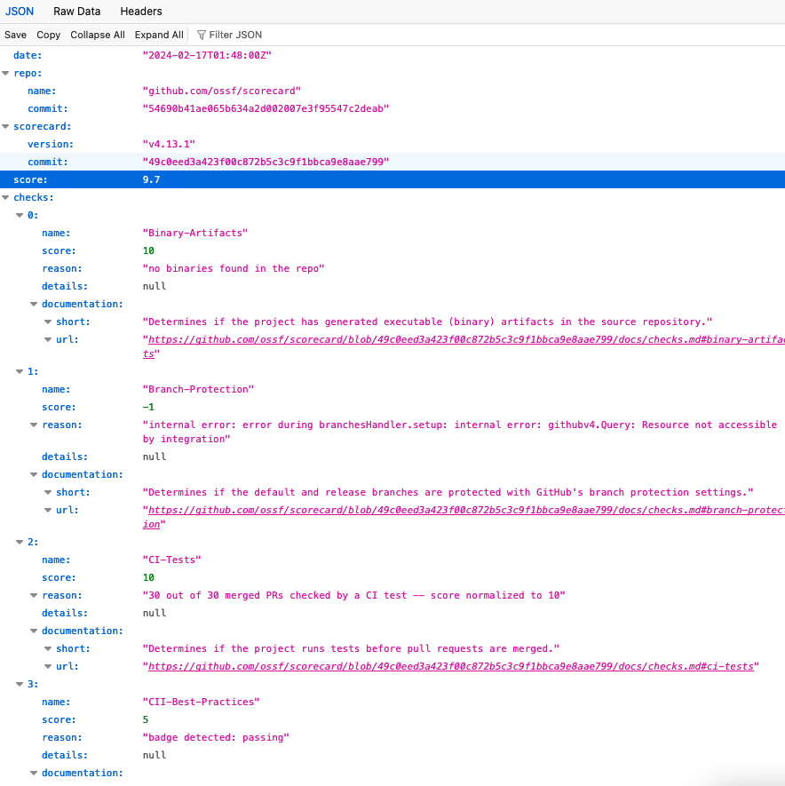

# Security Scorecard Web App 🧐 ✅

⭐️ This is part of a project for my Front-End Master as part of the JavaScript module. This project is for academic purposes only. For any further questions or potential contributions, please feel free to open an issue or submit a pull request 🙋‍♀️

## Overview

This web application leverages the OpenFFS scorecard API to evaluate the security vulnerabilities of given repositories. It covers various aspects such as source code, build processes, dependencies, testing, and project maintenance. The app shows an overall security scorecard ranking for a given repository and visualizes the checks through a radial graph. This project uses Chart.js for rendering the graphical representations. The interface includes a dynamic FAQ section for addressing common inquiries.

## Features

- Security Analysis: Fetches data from the OpenFFS scorecard API to assess vulnerabilities.
- Radial Graph Visualization: Uses Chart.js (MIT license) to display the security checks in a radial graph
- Styled Interface: Responsive design styled with CSS
- Dynamic FAQ Section: For user guidance and information

## Folder Structure

```
js/
    faq.js - Handles the FAQ section toggling
    radar-chart.js - Configures the Chart.js canvas for the radial graph
    fetch-api.js - Performs the GET request to the OpenFFS scorecard API
css/
    style.css - Styling rules
index.html - Structure
```

## Getting Started

### Installation

- Clone the repository to your local machine
- Open your favorite code editor
- Navigate to the project directory
- Open the index.html file in your browser to launch the application

## Usage

Enter the repository name you wish to analyze in the provided input field and submit. The application will fetch the security scorecard for the given repo and display the results as an overall ranking and a detailed radial graph illustrating each security check.

Make sure the format you use is:

```
platfrom/organization/repo
```

Below are a few examples that works and you can sue to test:

- github.com/pytorch/pytorch (should fetch data from https://api.securityscorecards.dev/projects/github.com/pytorch/pytorch)
- github.com/kubernetes/kubernetes (should fetch data from https://api.securityscorecards.dev/projects/github.com/kubernetes/kubernetes)
- gitbub.com/openssf/scorecard (should fetch data from https://api.securityscorecards.dev/projects/github.com/ossf/scorecard)



## Future Work

Plans to deploy the web application for broader accessibility, potentially using Netlify to simplify the deployment process

## License

This project is under MIT License
